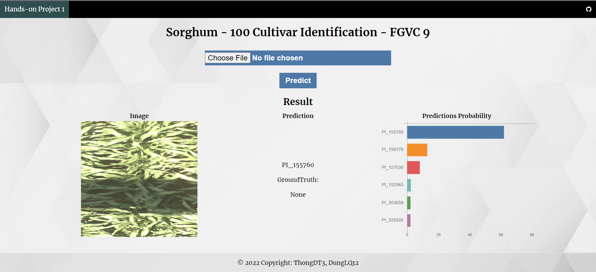

# Sorghum -100 Cultivar Identification - FGVC 9. [Link to competition](https://www.kaggle.com/competitions/sorghum-id-fgvc-9/overview)

## Team members:
1. Lương Quang Dũng - [quangdungluong](https://github.com/quangdungluong)
2. Đỗ Thành Thông - [DThanhThong](https://github.com/DThanhThong)

## Technology:
1. Baseline: [ResNet](https://arxiv.org/pdf/1512.03385.pdf) and [EfficientNet](https://arxiv.org/pdf/1905.11946.pdf)
2. [ArcFace](https://arxiv.org/pdf/1801.07698.pdf) and Instance-Batch Normalization
3. K-Fold Cross Validation
4. Test Time Augmentation
5. Data Augmentation: [CLAHE](https://albumentations.ai/docs/api_reference/augmentations/transforms/), Mixup, Cutmix

## Installation
```
git clone https://github.com/quangdungluong/Sorghum-100-FGVC9
cd Sorghum-100-FGVC9
pip install -r requirements.txt
```

## Demo
```
python app.py
```

## Training
- Sample notebook training:  [](https://www.kaggle.com/lqdisme/sorghum-arcface-resnet50-ibna-1024x1024-fold-2)
- Weight: [Google Drive](https://drive.google.com/file/d/1VBY5XYuFDgl7Zt2iBUQ85hC7DfcdxN8d/view?usp=sharing)
## Flask App:


## Reference
https://github.com/xinchenzju/CV-competition-arsenal